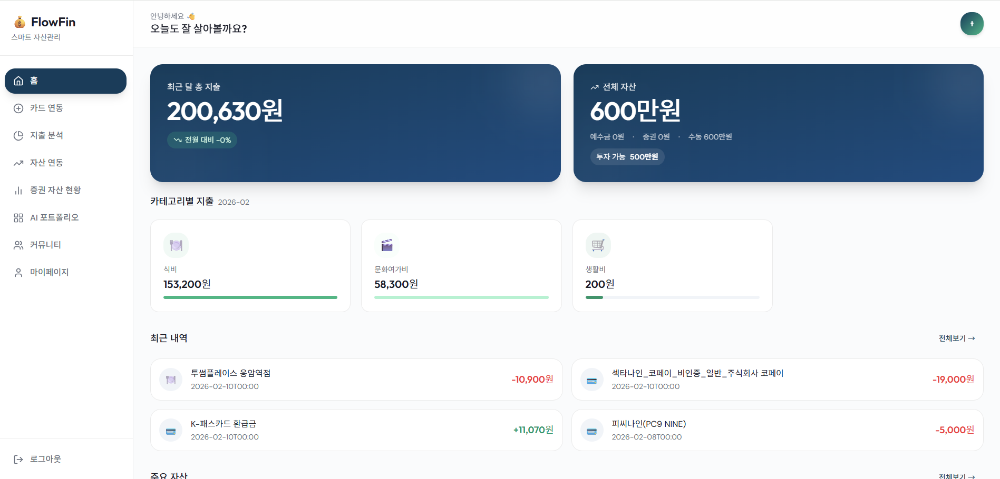
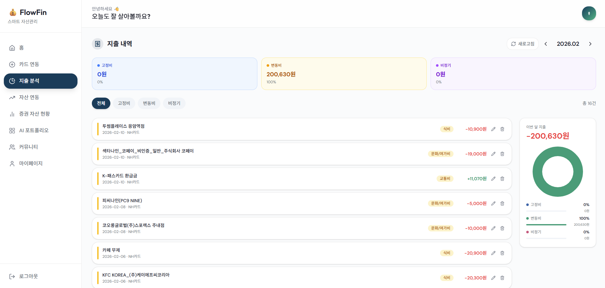
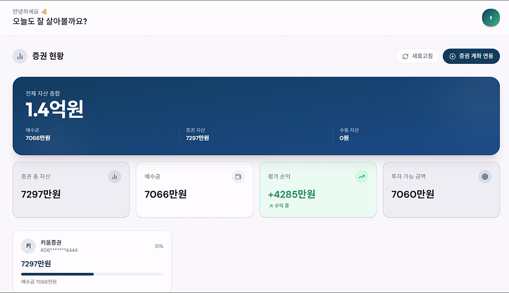
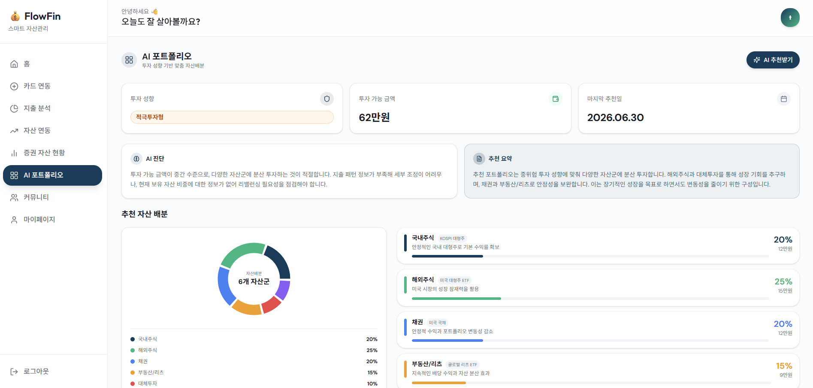
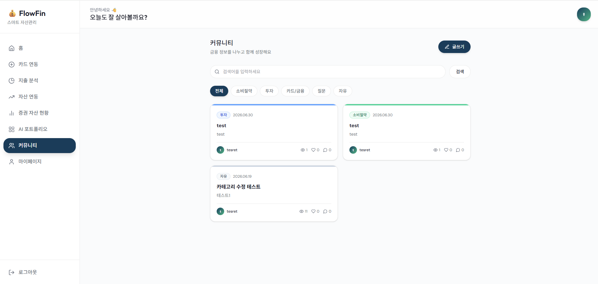

# Flowfin 클라이언트 (React 18)

Flowfin의 대시보드, 지출조회, 자산조회, AI 포트폴리오, 커뮤니티 화면을 제공하는 프론트엔드입니다.

> 프로젝트 전체 소개, 아키텍처, 기능 설명, 트러블슈팅은 백엔드 레포 README를 참고합니다.  
> 백엔드 README: (https://github.com/hecto-project-codefAPI/flowfin-server/blob/main/README.md)

## 기술 스택


## 프로젝트 구조

```text
src/
├─ api/                 # 인증, 지출, 자산, CODEF, 포트폴리오 API 클라이언트
├─ app/
│  ├─ App.tsx           # 인증 상태와 라우팅
│  ├─ api/              # 커뮤니티 API
│  ├─ components/
│  │  ├─ auth/          # 로그인, 회원가입, 투자성향 테스트
│  │  ├─ codef/         # CODEF 에러 모달
│  │  ├─ common/        # 공통 모달
│  │  ├─ layout/        # 대시보드 레이아웃
│  │  └─ ui/            # UI 컴포넌트
│  └─ pages/
│     ├─ community/     # 커뮤니티 목록, 상세, 작성
│     └─ terms/         # 약관 페이지
├─ constants/           # CODEF 에러 상수
├─ styles/              # Tailwind, 테마, 폰트 스타일
├─ types/               # 도메인 타입
└─ utils/               # 공통 유틸리티
```

## 주요 화면

### 대시보드

| 항목 | 내용 |
| --- | --- |
| 경로 | `/dashboard` |
| 설명 | 월 지출, 전체 자산, 카테고리 지출, 최근 내역을 요약합니다. |
| 데모<br />이미지 |  |

### 지출조회

| 항목 | 내용 |
| --- | --- |
| 경로 | `/expenses` |
| 설명 | 월별 지출 목록, 카테고리 필터, 카테고리 수정, 카드 동기화를 제공합니다. |
| 데모<br />이미지 |  |

### 자산조회

| 항목 | 내용 |
| --- | --- |
| 경로 | `/stocks` |
| 설명 | 증권 자산, 수동 등록 자산, 자산 구성 차트를 보여줍니다. |
| 데모<br />이미지 |  |

### 포트폴리오

| 항목 | 내용 |
| --- | --- |
| 경로 | `/portfolio/link` |
| 설명 | 투자성향과 투자 가능 금액 기반 AI 포트폴리오 추천과 이력을 제공합니다. |
| 데모<br />이미지 |  |

### 커뮤니티

| 항목 | 내용 |
| --- | --- |
| 경로 | `/community` |
| 설명 | 게시글 목록, 검색, 카테고리 필터, 작성/상세 화면으로 이동합니다. |
| 데모<br />이미지 |  |

## 실행 방법

```bash
pnpm install
pnpm dev
pnpm build
```
